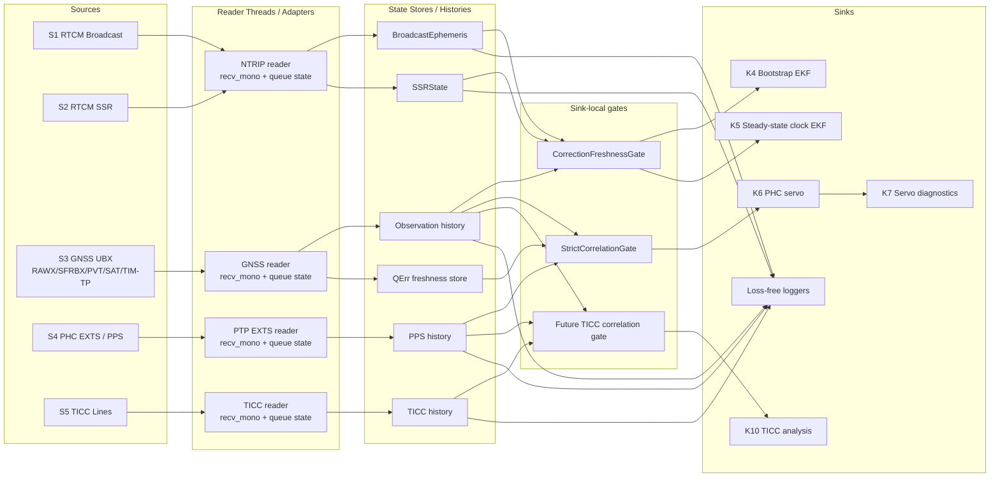

# Full Data Flow Inventory

This document inventories:

- live data sources
- the timescales carried by those sources
- sinks that consume those sources
- where correlation is required
- whether each sink prefers freshest-only or loss-free delivery
- whether decimation helps or harms

The main design goal is to make it obvious where time correlation is optional,
where it is mandatory, and where the wrong freshness policy would quietly
damage results.

This document also assumes a design direction:

- every source should expose enough metadata to estimate its relationship to
  the universal userspace timescale
- each sink should hard-code its own source list and timing policy at the
  point of event consumption
- this codebase does not currently need a general event bus or YAML dataflow
  registry to stay understandable

## Working map

The most useful visualization is no longer a single line-drawing diagram.
There are too many queues, state stores, gates, and sink-specific policies.

The better combination is:

- one compact structural map that shows where queues and gates sit
- one matrix that shows which sinks consume which sources and under what policy

Use the map for orientation and the matrix for truth.

## Source to sink policy matrix

`L` means loss-free is preferred. `F` means freshest/current state is preferred.
`CW` means correlated-window delivery is required. `Soft` means freshness gate,
not strict one-to-one event matching. `Strict` means explicit sink gate before
consumption.

| Sink | S1 RTCM Broadcast | S2 RTCM SSR | S3 GNSS Obs | S4 PPS/EXTTS | S5 TICC | Policy |
| --- | --- | --- | --- | --- | --- | --- |
| K1 Narrow GNSS loggers |  |  | Yes |  |  | `L`, no cross-stream correlation |
| K2 Broadcast ephemeris store | Yes |  |  |  |  | `F`, state cache |
| K3 SSR state store |  | Yes |  |  |  | `F`, state cache |
| K4 Bootstrap EKF | Yes | Optional | Yes |  |  | `Soft`, time-consistent corrections |
| K5 Steady-state clock EKF | Yes | Optional | Yes | Optional indirect |  | `Soft` alone, `Strict` when feeding servo |
| K6 PHC servo | Indirect via K5 | Indirect via K5 | Yes | Yes | Future | `CW`, `Strict` |
| K7 Servo diagnostics | Indirect | Indirect | Indirect | Indirect |  | inherited from upstream |
| K8 NTRIP caster output |  |  | Yes |  |  | freshest epoch, low correlation need |
| K9 PPS/TIM-TP diagnostics |  |  | TIM-TP subset | Yes |  | mixed, usually `L` with explicit joins |
| K10 TICC-based analysis | Optional overlay | Optional overlay | Optional overlay | Optional overlay | Yes | mostly `L` today, future `CW` |

## Why this complexity is justified

A simple read-and-deliver event model is still correct for some sinks.

Examples:

- narrow loggers
- state caches
- some simple diagnostics

Those sinks may want freshness or completeness, but they do not depend on
precise cross-stream timing.

Other sinks are fundamentally different.

Examples:

- the PHC servo
- future PPS deviation metrics
- future always-on dual-filter operation
- future tiny-motion position tracking

For these sinks, a mis-correlated event can be worse than silence.

Examples:

- a servo may steer the PHC the wrong way
- a timing metric may report false phase error
- a filter may absorb bad state and take many epochs to recover

So the added complexity is not for its own sake. It exists because:

- multiple source-native timescales are present
- queueing can occur at startup and in steady state
- different sinks need different loss/freshness/correlation policies
- one global policy would either lose important data or accept bad matches

That is why this design favors:

- source metadata that preserves timing ambiguity instead of hiding it
- sink-local policy at the point of consumption
- dropping at the correlation edge rather than blindly at ingress

## Core design rule

Every source should eventually provide:

- source-native event timestamp
- host `CLOCK_MONOTONIC` receive timestamp
- a boolean or equivalent indicator of whether more unread data was queued at
  the moment of read
- event identity and enough metadata to interpret it

Every sink should explicitly declare:

- what source-native timescales it needs
- whether cross-stream correlation is required
- whether it wants freshest-only, loss-free, or windowed correlation
- queue depth tolerance
- decimation policy
- acceptable correlation confidence

The policy belongs in code at the point of event consumption. That is where the
rubber meets the road.

## Universal correlation axis

The preferred universal correlation axis is host `CLOCK_MONOTONIC`.

The goal is that any pair of source-native timescales should be relatable via:

- source-native timestamp
- host monotonic receive timestamp
- a confidence estimate for that specific mapping

That confidence should be higher when:

- the read happened with no queued data behind it
- packet age between device receipt and parse is low
- the stream is known not to be backlogged

That confidence should be lower when:

- multiple packets were clearly queued
- the reader drained a backlog burst
- host scheduling delay may have postponed the read
- the source transport is known to batch deliveries

An EMA or other slow-moving estimator of each source-timescale to host-monotonic
relationship is a good candidate, but the key point is that correlation should
be confidence-weighted, not treated as equally trustworthy for every sample.

## Timescales

The repo already contains or uses the following timescales:

- Host `CLOCK_MONOTONIC`
  - current best universal userspace correlation axis
- Host UTC wall clock
  - useful for logs and persisted metadata, not ideal for correlation
- GPS time
  - receiver RAWX epochs, much of solver time
- Galileo system time / GST
  - present in Galileo broadcast ephemeris payloads
- BeiDou time / BDT
  - present in BDS broadcast ephemeris payloads
- PHC timescale
  - whatever the PHC is currently representing: `gps`, `utc`, or `tai`
- TICC boot-relative time
  - `ref_sec + ref_ps`
- Receiver timing-pulse error term space
  - `TIM-TP.qErr`, not a timescale by itself but part of timing correlation

## Source inventory

### S1. NTRIP RTCM ephemeris stream

Ingress:

- [`NtripStream`](/home/bob/git/PePPAR-Fix/scripts/ntrip_client.py)
- consumed by [`ntrip_reader()`](/home/bob/git/PePPAR-Fix/scripts/realtime_ppp.py#L415)

Examples:

- RTCM `1019`
- RTCM `1042`
- RTCM `1045`
- RTCM `1046`

Payload timestamps:

- ephemeris `week`
- `toe`
- `toc`

Timescale:

- GPS for GPS ephemeris
- GST for Galileo ephemeris payloads
- BDT for BeiDou ephemeris payloads

What the timestamp marks:

- reference epoch of the broadcast orbit/clock model

Current host-side timing attached:

- no per-message host monotonic timestamp
- `BroadcastEphemeris` itself stores the model, not receipt timing

Desired host-side timing attached:

- host monotonic receive timestamp per RTCM message or per parsed correction
- queue-remains indicator from the socket reader
- sample confidence for the message-native epoch to host-monotonic mapping

### S2. NTRIP RTCM SSR correction stream

Ingress:

- [`NtripStream`](/home/bob/git/PePPAR-Fix/scripts/ntrip_client.py)
- consumed by [`ntrip_reader()`](/home/bob/git/PePPAR-Fix/scripts/realtime_ppp.py#L415)

Examples:

- IGS SSR `4076_*`
- standard RTCM SSR `1057-1068`, `1240-1263`

Payload timestamps:

- `epoch_s`

Timescale:

- system-specific GNSS correction epoch from the RTCM/SSR message

What the timestamp marks:

- epoch at which the SSR state applies

Current host-side timing attached:

- `OrbitCorrection.rx_time`
- `ClockCorrection.rx_time`
- `BiasCorrection.rx_time`
in [`ssr_corrections.py`](/home/bob/git/PePPAR-Fix/scripts/ssr_corrections.py)
- these are host UTC wall-clock timestamps

Desired host-side timing attached:

- host monotonic receive timestamp
- queue-remains indicator
- confidence for the correction epoch to host-monotonic mapping

### S3. GNSS observation stream

Ingress:

- [`serial_reader()`](/home/bob/git/PePPAR-Fix/scripts/realtime_ppp.py#L150)
- underlying device opened by [`open_gnss()`](/home/bob/git/PePPAR-Fix/scripts/peppar_fix/gnss_stream.py#L184)

Transport variants:

- serial USB/UART device
- kernel GNSS char device such as `/dev/gnss0`

Messages:

- `RXM-RAWX`
- `RXM-SFRBX`
- `NAV-PVT`
- `NAV-SAT`
- `TIM-TP`

Payload timestamps:

- `RXM-RAWX`: `week`, `rcvTow`, `leapS`
- `NAV-PVT`: UTC-like calendar solution time plus `iTOW`
- `TIM-TP`: `week`, `towMS`, `towSubMS`, `qErr`

Timescale:

- mostly GPS time for RAWX
- UTC-like navigation time for PVT
- GNSS-referenced epoch fields for TIM-TP

What the timestamp marks:

- observation epoch
- navigation solution epoch
- receiver timing pulse epoch

Current host-side timing attached:

- `ObservationEvent.recv_mono`
- `ObservationEvent.recv_utc`
- packet-level receive timestamp for kernel GNSS devices
- `QErrStore` freshness timestamp using `CLOCK_MONOTONIC`

Desired host-side timing attached:

- a queue-remains indicator from every reader path
- sample confidence for the mapping from embedded receiver time to host monotonic

### S4. PHC PPS / EXTS stream

Ingress:

- [`PtpDevice.read_extts()`](/home/bob/git/PePPAR-Fix/scripts/peppar_fix/ptp_device.py#L111)

Payload timestamps:

- `phc_sec`
- `phc_nsec`
- `index`

Timescale:

- PHC timescale

What the timestamp marks:

- PPS edge timestamp as measured by the PHC/PTP subsystem

Current host-side timing attached:

- unified path wraps this in `PpsEvent.recv_mono`

Desired host-side timing attached:

- queue-remains indicator if the kernel event queue still had unread EXTS events
- confidence estimate for PHC-time to host-monotonic mapping

### S5. TICC edge stream

Ingress:

- [`Ticc.__iter__()`](/home/bob/git/PePPAR-Fix/scripts/ticc.py#L127)

Payload timestamps:

- `ref_sec`
- `ref_ps`
- `channel`

Timescale:

- TICC time since boot

What the timestamp marks:

- measured arrival time of each edge on each TICC channel

Current host-side timing attached:

- in [`analyze_servo.py`](/home/bob/git/PePPAR-Fix/scripts/analyze_servo.py), capture mode logs host UTC wall time as `host_timestamp`
- no host monotonic timestamp is attached today

Desired host-side timing attached:

- host monotonic receive timestamp for every TICC line
- queue-remains indicator if available from the serial reader path
- confidence estimate for TICC-boot time to host-monotonic mapping

### S6. NTRIP caster client sockets

Ingress:

- accepted TCP clients in [`ntrip_caster.py`](/home/bob/git/PePPAR-Fix/scripts/ntrip_caster.py)

Payload timestamps:

- none relevant for GNSS/PHC correlation

This is still part of the data-flow graph because it is an output-facing sink of local GNSS observations.

## Sink inventory

## K1. Narrow GNSS loggers

Examples:

- [`log_observations.py`](/home/bob/git/PePPAR-Fix/scripts/log_observations.py)
- `*_rawx.csv`
- `*_pvt.csv`
- `*_timtp.csv`
- raw `.ubx`

Sources consumed:

- S3 only

Correlation required:

- none across streams

Freshness preference:

- loss-free is preferred

Queueing tolerance:

- high

Decimation:

- usually harmful if the goal is archival capture

Notes:

- this class of sink is tolerant of queued data and should not discard just because data is old

## K2. Broadcast ephemeris store

Code:

- [`BroadcastEphemeris`](/home/bob/git/PePPAR-Fix/scripts/broadcast_eph.py)

Sources consumed:

- S1
- optionally receiver `RXM-SFRBX` in concept, though current live path relies mainly on RTCM

Correlation required:

- low
- each message updates per-satellite model state independently

Freshness preference:

- freshest valid state per satellite

Queueing tolerance:

- moderate

Decimation:

- usually beneficial once state is current

Notes:

- this sink is a state cache, not a per-event estimator

## K3. SSR state store

Code:

- [`SSRState`](/home/bob/git/PePPAR-Fix/scripts/ssr_corrections.py)

Sources consumed:

- S2

Correlation required:

- low internally
- state is keyed by epoch/IOD, not correlated with PPS directly

Freshness preference:

- freshest valid correction per satellite/signal

Queueing tolerance:

- moderate

Decimation:

- usually beneficial if old corrections are superseded

Notes:

- the store already ages corrections using host UTC receive time
- it should eventually also carry host monotonic receive time

## K4. Bootstrap position EKF

Code:

- [`PPPFilter`](/home/bob/git/PePPAR-Fix/scripts/solve_ppp.py)
- driven by:
  - [`peppar_find_position.py`](/home/bob/git/PePPAR-Fix/scripts/peppar_find_position.py)
  - [`peppar_fix_cmd.py`](/home/bob/git/PePPAR-Fix/scripts/peppar_fix_cmd.py)
  - [`peppar_fix_main.py`](/home/bob/git/PePPAR-Fix/scripts/peppar_fix_main.py)

Sources consumed:

- S3 GNSS observations
- S1 broadcast ephemeris
- S2 SSR corrections when available

Correlation required:

- yes between observations and orbital/clock/bias state
- no PPS required for position bootstrap itself today

Freshness preference:

- should prefer time-consistent data over merely freshest data

Queueing tolerance:

- moderate if the stream is internally time-consistent

Decimation:

- can help computationally
- can hurt convergence speed if overdone

Notes:

- today bootstrap can operate without PPS correlation
- for future always-on precise position tracking of tiny motions, this sink should probably be loss-minimizing rather than freshest-only

## K5. Steady-state clock EKF

Code:

- [`FixedPosFilter`](/home/bob/git/PePPAR-Fix/scripts/solve_ppp.py)
- used by:
  - [`realtime_ppp.py`](/home/bob/git/PePPAR-Fix/scripts/realtime_ppp.py)
  - [`peppar_fix_cmd.py`](/home/bob/git/PePPAR-Fix/scripts/peppar_fix_cmd.py)
  - [`phc_servo.py`](/home/bob/git/PePPAR-Fix/scripts/phc_servo.py)
  - [`peppar_phc_servo.py`](/home/bob/git/PePPAR-Fix/scripts/peppar_phc_servo.py)
  - [`peppar_fix_main.py`](/home/bob/git/PePPAR-Fix/scripts/peppar_fix_main.py)

Sources consumed:

- S3 GNSS observations
- S1 broadcast ephemeris
- S2 SSR corrections

Correlation required:

- yes between observations and correction state
- for plain clock estimation, PPS is not always required
- for servo use, PPS correlation becomes mandatory

Freshness preference:

- wants time-consistent data
- may reasonably skip stale observations if they cannot be matched to required auxiliary data

Queueing tolerance:

- moderate for pure clock estimation
- lower when feeding a real-time servo

Decimation:

- may help low-rate long-term analyses
- hurts fast control use cases

## K6. PHC servo

Code:

- [`peppar_fix_cmd.py`](/home/bob/git/PePPAR-Fix/scripts/peppar_fix_cmd.py)
- legacy:
  - [`phc_servo.py`](/home/bob/git/PePPAR-Fix/scripts/phc_servo.py)
  - [`peppar_phc_servo.py`](/home/bob/git/PePPAR-Fix/scripts/peppar_phc_servo.py)
  - [`peppar_fix_main.py`](/home/bob/git/PePPAR-Fix/scripts/peppar_fix_main.py)

Sources consumed:

- S4 PPS/EXTTS events
- S3 GNSS observations
- S3 TIM-TP `qErr`
- S1/S2 indirectly through the clock EKF

Correlation required:

- strict
- this sink is highly sensitive to wrong time correlation

Freshness preference:

- strongest preference for time-correlated data
- not merely freshest
- not merely loss-free
- wants all required streams matched within a valid window

Queueing tolerance:

- low for unmatched stale data
- moderate for delayed data only if correlation logic can still prove a correct match

Decimation:

- usually harmful for control
- averaging/discipline intervals are acceptable when deliberate and model-based

Notes:

- this sink is the clearest case where wrong correlation can be worse than dropping data

## K7. Servo CSV diagnostics

Code:

- servo logs in:
  - [`peppar_fix_cmd.py`](/home/bob/git/PePPAR-Fix/scripts/peppar_fix_cmd.py)
  - [`phc_servo.py`](/home/bob/git/PePPAR-Fix/scripts/phc_servo.py)
  - [`peppar_phc_servo.py`](/home/bob/git/PePPAR-Fix/scripts/peppar_phc_servo.py)

Sources consumed:

- whatever the servo path has already correlated

Correlation required:

- inherited from the servo

Freshness preference:

- loss-free for logging

Queueing tolerance:

- high, once the upstream decision has already been made

Decimation:

- beneficial if logs become too large

## K8. NTRIP caster output

Code:

- [`NtripCasterServer`](/home/bob/git/PePPAR-Fix/scripts/ntrip_caster.py)
- raw callback path from [`phc_servo.py`](/home/bob/git/PePPAR-Fix/scripts/phc_servo.py)

Sources consumed:

- S3 RAWX observations
- known reference position file for `1005`

Correlation required:

- low
- primarily epoch-preserving re-encoding of GNSS observations

Freshness preference:

- freshest available observation epoch

Queueing tolerance:

- low to moderate

Decimation:

- often beneficial if clients do not need every possible epoch detail

## K9. PPS/TIM-TP quality diagnostics

Examples:

- [`qerr_test.py`](/home/bob/git/PePPAR-Fix/scripts/qerr_test.py)
- future PPS deviation metrics

Sources consumed:

- S3 TIM-TP
- optionally S3 observations and S1/S2 through `FixedPosFilter`

Correlation required:

- moderate
- `qErr` must be fresh relative to the epoch being discussed

Freshness preference:

- usually freshest or windowed-fresh

Queueing tolerance:

- moderate for statistical studies

Decimation:

- often beneficial for long runs

## K10. TICC-based servo analysis

Code:

- [`analyze_servo.py`](/home/bob/git/PePPAR-Fix/scripts/analyze_servo.py)

Sources consumed:

- S5 TICC stream
- optional servo log overlay from K7

Correlation required:

- yes within the TICC stream itself
- optional loose overlay with servo logs

Freshness preference:

- loss-free

Queueing tolerance:

- high

Decimation:

- helpful for plotting
- harmful if it destroys short-tau ADEV/TDEV content

Notes:

- this is a measurement-analysis sink, not a control sink

## K11. Future long-running position-motion filter

Planned, not implemented as a distinct always-on sink yet.

Sources expected:

- S3 observations
- S1/S2 corrections
- possibly environmental or quality metrics later

Correlation required:

- yes between observations and corrections
- PPS may be optional depending on goal

Freshness preference:

- loss-free or nearly loss-free

Queueing tolerance:

- high if correlation remains correct

Decimation:

- can be beneficial after proper anti-aliasing or aggregation

Notes:

- this is the opposite of a control sink
- queued historical data can still be valuable if time-consistent

## K12. Future real-time quality-metric sinks

Planned examples:

- PPS IN deviation metrics
  - ADEV
  - TDEV
- GNSS signal quality metrics
  - multipath / MCM
  - number of SVs
  - C/N0 or signal strength by elevation

Expected sources:

- S3 observations
- S4 PPS events
- S5 TICC where available
- possibly K6/K7 outputs as already-correlated derived streams

Correlation required:

- depends on metric
- some metrics are single-stream
- others need careful windowed correlation

Freshness preference:

- usually more tolerant than a servo
- often wants all data, then aggregates

Queueing tolerance:

- moderate to high

Decimation:

- often beneficial after correct aggregation

## Source-to-sink map

### S1. RTCM ephemeris

Feeds:

- K2 broadcast ephemeris store
- K4 bootstrap position EKF
- K5 steady-state clock EKF
- K6 PHC servo indirectly through K5
- K9 diagnostics indirectly
- K11 future long-running motion filter

### S2. RTCM SSR corrections

Feeds:

- K3 SSR state store
- K4 bootstrap position EKF
- K5 steady-state clock EKF
- K6 PHC servo indirectly through K5
- K9 diagnostics indirectly
- K11 future long-running motion filter

### S3. GNSS receiver stream

Feeds:

- K1 narrow GNSS loggers
- K4 bootstrap position EKF
- K5 steady-state clock EKF
- K6 PHC servo
- K8 NTRIP caster output
- K9 PPS/TIM-TP quality diagnostics
- K11 future long-running motion filter
- K12 future signal-quality sinks

### S4. PPS/EXTTS stream

Feeds:

- K6 PHC servo
- K7 servo diagnostics
- K12 future PPS deviation metrics

### S5. TICC stream

Feeds:

- K10 TICC-based servo analysis
- K12 future PPS deviation metrics

## Correlation classes

### Class A: no cross-stream correlation required

Examples:

- K1 narrow loggers
- K2 broadcast ephemeris store
- K3 SSR state store

These sinks may still care about freshness, but incorrect cross-stream pairing is not the main risk.

### Class B: soft correlation required

Examples:

- K4 bootstrap position EKF
- K5 steady-state clock EKF when not driving a servo
- K9 `qErr` diagnostics
- K11 future motion filter

These sinks need internally time-consistent data but may tolerate delayed or queued data if the timestamps still line up.

### Class C: strict correlation required

Examples:

- K6 PHC servo
- some future K12 PPS deviation metrics

These sinks should reject unmatched or ambiguously matched data rather than ingest it optimistically.

For these sinks, silence is usually safer than a wrong match.

Implementation direction:

- put an explicit correlation gate in front of each strict sink
- the gate may only:
  - consume correlated events
  - defer delivery while waiting for a valid companion event
  - drop events that can no longer be matched inside policy
- the sink itself should not read raw source queues directly

For EKF updates that do not consume PPS directly, the gate is softer:

- observations still define the epoch
- correction state must be fresh enough for that epoch
- stale correction state should defer or drop the EKF update before
  `filt.update(...)`, even when no PPS correlation is involved

## Startup checks and runtime watchdogs

These are separate concerns and should stay separate in the code:

- startup receiver verification
  - good for confirming that configurable sources such as GNSS receivers are
    still emitting the required message types and signal families before the
    main sinks start
  - for the F9T family this means at least:
    - `RXM-RAWX`
    - `RXM-SFRBX`
    - `NAV-PVT`
    - `TIM-TP`
  - if startup verification fails, it is reasonable to re-run the receiver
    configuration flow before proceeding
- runtime stream watchdogs
  - should not reconfigure devices just because a stream stuttered
  - should only note that a source has been quiet for longer than policy
  - should be configurable per source
  - should bark during fault-injection and real stream stalls

Runtime watchdogs are diagnostic, not corrective:

- the system should keep running through transient stutters
- sinks and gates should continue to apply their own correlation/drop policy
- watchdog logs should simply tell us when:
  - GNSS observation stream has gone quiet
  - PPS/EXTTS stream has gone quiet
  - RTCM stream has gone quiet
  - TICC stream has gone quiet

## Freshest-only vs loss-free vs correlated-window

There are really three policies, not two.

### Freshest-only

Best for:

- state caches
- some outbound low-latency services

Examples:

- K2
- K3
- some parts of K8

### Loss-free

Best for:

- archival logging
- long-term analysis
- tiny-motion estimation

Examples:

- K1
- K10
- K11

### Correlated-window

Best for:

- any sink that needs multiple streams matched correctly

Examples:

- K6
- parts of K5
- some future K12 metrics

This is the policy the servo should use. It should not confuse “newest” with “best,” and it should not confuse “all queued data” with “all useful data.”

This is also why one-size-fits-all queue handling is the wrong design.

- forcing freshest-only would destroy long-horizon scientific sinks
- forcing loss-free would feed stale or ambiguous matches into strict sinks
- forcing one global correlation window would be wrong for both
  low-latency control and long-horizon analysis

## Reader contract

The direction implied by this inventory is that every live reader should return
something equivalent to:

- parsed event payload
- host monotonic receive timestamp
- host UTC receive timestamp if useful for logs
- queue-remains boolean
- optional parse-age estimate

For streams with embedded timestamps, the parse layer should combine:

- embedded source timestamp
- host receive timestamp
- queue-remains boolean
- known transport behavior

into a sample-level confidence score for source-time to host-monotonic mapping.

## Sink contract

Each sink should document in code:

- exact sources required
- whether each source is mandatory or optional
- whether unmatched events may be buffered, dropped, or ignored
- maximum queue depth tolerated
- decimation policy
- correlation window
- minimum confidence required for cross-stream use

This should stay close to the consumption point instead of being abstracted
into a global registry.

## Current architectural gaps

This section is meant to be operational. Each gap lists not just what is
missing, but also where it should be fixed first and which sinks are exposed
to the risk.

### G1. RTCM receive timestamps are incomplete

Today:

- correction objects store host UTC `rx_time`

Missing:

- host monotonic receive timestamp per RTCM message or per correction update
- queue-remains state from the NTRIP socket reader
- any sample confidence for mapping correction epochs to host monotonic

Where it should be fixed first:

- [`scripts/ntrip_client.py`](/home/bob/git/PePPAR-Fix/scripts/ntrip_client.py)
- [`scripts/realtime_ppp.py`](/home/bob/git/PePPAR-Fix/scripts/realtime_ppp.py)
- [`scripts/ssr_corrections.py`](/home/bob/git/PePPAR-Fix/scripts/ssr_corrections.py)

Impact:

- harder to correlate correction freshness against observations using one universal axis
- impossible to derive a confident source-time to monotonic mapping for RTCM today

Highest-risk sinks:

- K4 bootstrap position EKF
- K5 steady-state clock EKF
- K6 PHC servo
- K11 future long-running motion filter

### G2. TICC lacks host monotonic receive timestamp

Today:

- `analyze_servo.py` stores host UTC wall time

Missing:

- host monotonic receive timestamp at line ingest
- queue-remains state from the serial reader path
- any confidence model for TICC time to host monotonic

Impact:

- harder to align TICC with other live streams on one userspace timescale
- no direct way to compute a confidence-weighted TICC-to-monotonic relationship

Where it should be fixed first:

- [`scripts/ticc.py`](/home/bob/git/PePPAR-Fix/scripts/ticc.py)
- [`scripts/analyze_servo.py`](/home/bob/git/PePPAR-Fix/scripts/analyze_servo.py)

Highest-risk sinks:

- K10 TICC-based servo analysis
- K12 future PPS deviation metrics

### G3. Legacy servo paths still use older queue assumptions

Files:

- [`phc_servo.py`](/home/bob/git/PePPAR-Fix/scripts/phc_servo.py)
- [`peppar_phc_servo.py`](/home/bob/git/PePPAR-Fix/scripts/peppar_phc_servo.py)
- [`peppar_fix_main.py`](/home/bob/git/PePPAR-Fix/scripts/peppar_fix_main.py)

Impact:

- risk of different sinks silently using different freshness and drop policies
- risk of one path rejecting stale data while another path consumes it as if it were fresh
- risk of future fixes landing in only one path

Where it should be fixed first:

- compare each path against the unified history-based logic in [`scripts/peppar_fix_cmd.py`](/home/bob/git/PePPAR-Fix/scripts/peppar_fix_cmd.py)
- either converge the paths or demote the legacy ones

Highest-risk sinks:

- K6 PHC servo
- K7 servo diagnostics

### G4. Readers do not expose queue-remains state consistently

Today:

- some readers can infer backlog indirectly
- no common reader contract returns “more unread data was queued behind this event”

Impact:

- we cannot distinguish a prompt read from a backlogged read with enough confidence
- we cannot up-weight samples that are known to be queue-free

Missing:

- reader-level `queue_remains` boolean or equivalent
- a consistent meaning of queue state across socket, serial, kernel-char-device, and PTP readers

Where it should be fixed first:

- [`scripts/peppar_fix/gnss_stream.py`](/home/bob/git/PePPAR-Fix/scripts/peppar_fix/gnss_stream.py)
- [`scripts/ntrip_client.py`](/home/bob/git/PePPAR-Fix/scripts/ntrip_client.py)
- [`scripts/peppar_fix/ptp_device.py`](/home/bob/git/PePPAR-Fix/scripts/peppar_fix/ptp_device.py)
- [`scripts/ticc.py`](/home/bob/git/PePPAR-Fix/scripts/ticc.py)

Highest-risk sinks:

- K5 steady-state clock EKF
- K6 PHC servo
- K12 future quality metrics

### G5. Source-timescale relationship estimation is only partially implemented

Impact:

- without an estimator, queued samples and prompt samples are treated too similarly
- sinks need a stable nominal source-time to host-monotonic relationship as a baseline

Current state:

- [`scripts/peppar_fix/timebase_estimator.py`](/home/bob/git/PePPAR-Fix/scripts/peppar_fix/timebase_estimator.py)
  now provides a weighted constant-offset estimator of source-time to
  host-monotonic offset and residual sigma
- GNSS observation ingest in
  [`scripts/realtime_ppp.py`](/home/bob/git/PePPAR-Fix/scripts/realtime_ppp.py)
  now blends queue/age heuristics with estimator confidence
- PPS ingest in
  [`scripts/peppar_fix_cmd.py`](/home/bob/git/PePPAR-Fix/scripts/peppar_fix_cmd.py)
  now does the same for EXTS events before they reach the strict gate
- estimator updates are weighted by sample trust, not by recency
- visible backlog now causes an estimator sample to move the offset estimate
  only very lightly relative to a prompt no-backlog sample

Still missing:

- broader RTCM estimator coverage where a true stream epoch exists
- broadcast ephemeris still intentionally excluded from estimator updates
  because toe/toc are model epochs, not receive/emit timestamps
- per-platform/profile tuning of estimator parameters
- consistent exposure of estimator residuals in sink logs and diagnostics
- a way for sinks to consume both nominal alignment and residual confidence explicitly

Where it should be fixed first:

- RTCM ingest in [`scripts/ntrip_client.py`](/home/bob/git/PePPAR-Fix/scripts/ntrip_client.py)
- correction stores in [`scripts/broadcast_eph.py`](/home/bob/git/PePPAR-Fix/scripts/broadcast_eph.py)
  and [`scripts/ssr_corrections.py`](/home/bob/git/PePPAR-Fix/scripts/ssr_corrections.py)
- TICC ingest in [`scripts/ticc.py`](/home/bob/git/PePPAR-Fix/scripts/ticc.py)
- sink logging in [`scripts/servo_fault_smoke.py`](/home/bob/git/PePPAR-Fix/scripts/servo_fault_smoke.py)

Highest-risk sinks:

- K6 PHC servo
- K11 future long-running motion filter
- K12 future PPS and signal-quality metrics

### G6. Sink policy is not documented consistently at the consumption point

Impact:

- the intended fresh/loss-free/correlated-window behavior is easy to lose during edits
- parallel always-on sinks will be harder to add safely

Missing:

- code-local declaration of:
  - required sources
  - optional sources
- queue depth tolerance
- decimation policy

For strict sinks, this contract should be implemented by a gate ahead of the
sink, not by ad hoc checks scattered through the sink body.
  - freshness/loss policy
  - correlation window
  - minimum acceptable confidence

Where it should be fixed first:

- [`scripts/peppar_fix_cmd.py`](/home/bob/git/PePPAR-Fix/scripts/peppar_fix_cmd.py)
- [`scripts/phc_servo.py`](/home/bob/git/PePPAR-Fix/scripts/phc_servo.py)
- [`scripts/peppar_find_position.py`](/home/bob/git/PePPAR-Fix/scripts/peppar_find_position.py)
- [`scripts/analyze_servo.py`](/home/bob/git/PePPAR-Fix/scripts/analyze_servo.py)

Highest-risk sinks:

- K4 bootstrap position EKF
- K5 steady-state clock EKF
- K6 PHC servo
- K11 future long-running motion filter

### G7. Event envelope types are too thin

Today:

- [`ObservationEvent`](/home/bob/git/PePPAR-Fix/scripts/peppar_fix/event_time.py)
  carries `gps_time`, payload, `recv_mono`, `recv_utc`
- [`PpsEvent`](/home/bob/git/PePPAR-Fix/scripts/peppar_fix/event_time.py)
  carries PHC timestamp plus `recv_mono`

Missing:

- queue-remains state
- parse-age estimate
- source kind or transport metadata
- sample confidence field
- equivalent envelope for TICC and RTCM-derived events

Impact:

- the new correlation model cannot be expressed cleanly in data structures
- reader-specific ad hoc side channels will proliferate

Where it should be fixed first:

- [`scripts/peppar_fix/event_time.py`](/home/bob/git/PePPAR-Fix/scripts/peppar_fix/event_time.py)

Highest-risk sinks:

- all Class B and Class C sinks

### G8. Correction stores treat freshness as wall-clock age, not correlation age

Today:

- SSR state ages corrections using host UTC `rx_time`

Missing:

- monotonic-age evaluation
- queue-aware confidence
- distinction between “newly received” and “still the best matching correction for this observation epoch”

Impact:

- acceptable for coarse staleness rejection
- insufficient for high-confidence cross-stream correlation

Where it should be fixed first:

- [`scripts/ssr_corrections.py`](/home/bob/git/PePPAR-Fix/scripts/ssr_corrections.py)

Highest-risk sinks:

- K5 steady-state clock EKF
- K6 PHC servo
- K11 future long-running motion filter

### G9. Platform-specific batching behavior is measured, but not modeled

Today:

- we know `/dev/gnss0` on `oxco` batches
- we have a probe script for it

Missing:

- a place in the runtime model where known platform behavior changes correlation confidence
- platform-level documentation at the exact reader/consumer boundaries in code

Impact:

- operators and future code can rediscover the same issue repeatedly
- sink behavior may remain platform-sensitive in surprising ways

Where it should be fixed first:

- [`scripts/gnss_lag_probe.py`](/home/bob/git/PePPAR-Fix/scripts/gnss_lag_probe.py)
- [`scripts/peppar_fix/gnss_stream.py`](/home/bob/git/PePPAR-Fix/scripts/peppar_fix/gnss_stream.py)
- sink comments at the consumption points in K5 and K6

Highest-risk sinks:

- K5 steady-state clock EKF
- K6 PHC servo
- K11 future long-running motion filter

## Coding milestones

These milestones are ordered from minimum shared infrastructure through
sink-specific policy cleanup.

### M1. Standardize event envelopes

Goal:

- make the basic event types rich enough to carry timing and queue metadata

Required work:

- extend event envelopes to carry:
  - source-native timestamp
  - host monotonic receive time
  - optional host UTC receive time
  - queue-remains indicator
  - optional parse-age estimate
  - optional confidence field
- add equivalent envelope types for RTCM-derived events and TICC events

This milestone addresses:

- G2
- G4
- G7

### M2. Standardize reader return metadata

Goal:

- every live reader returns timing metadata in a common shape

Required work:

- GNSS readers should expose packet timing and queue-remains state
- PTP/EXTTS readers should expose whether more EXTS events remained queued
- NTRIP readers should expose per-message receive timing and queue-remains state
- TICC readers should expose host monotonic receive time

This milestone addresses:

- G1
- G2
- G4

### M3. Remove hidden queue-drain and newest-wins point solutions

Goal:

- stop losing timing information in ad hoc queue cleanup paths

Required work:

- inventory and review all places where:
  - queues are drained on open
  - queues are explicitly flushed at phase transitions
  - oldest events are discarded because newer ones arrived
  - stale events are dropped before a sink-specific policy can evaluate them
- preserve those behaviors only where a sink truly requires them
- move the decision to drop closer to the sink or correlator

Examples in current code:

- [`scripts/peppar_fix/gnss_stream.py`](/home/bob/git/PePPAR-Fix/scripts/peppar_fix/gnss_stream.py) `discard_input()`
- [`scripts/peppar_fix_cmd.py`](/home/bob/git/PePPAR-Fix/scripts/peppar_fix_cmd.py) `_drain_queue()`
- [`scripts/peppar_fix_cmd.py`](/home/bob/git/PePPAR-Fix/scripts/peppar_fix_cmd.py) phase-transition PPS flush
- [`scripts/phc_servo.py`](/home/bob/git/PePPAR-Fix/scripts/phc_servo.py) `get_latest_pps_event()`
- legacy queue-dropping patterns in [`scripts/peppar_fix_main.py`](/home/bob/git/PePPAR-Fix/scripts/peppar_fix_main.py) and [`scripts/peppar_phc_servo.py`](/home/bob/git/PePPAR-Fix/scripts/peppar_phc_servo.py)

This milestone addresses:

- G3
- G4
- G6

Progress so far:

- unified path no longer drains the observation queue when entering steady state
- unified PPS notification queue now drops one oldest notification on overflow
  instead of draining the whole queue
- legacy servo entry points now use the same bounded overflow pattern, though
  some still retain newest-wins consume logic

### M4. Add source-timescale relationship estimators

Goal:

- make source-native time to host-monotonic mapping explicit and confidence-weighted

Required work:

- define a small estimator per source class
- support slow-moving tracking such as EMA
- incorporate:
  - queue-remains state
  - packet age
  - known batching behavior
- expose sample confidence to sinks

This milestone addresses:

- G5
- G8
- G9

Progress so far:

- GNSS observation events carry `recv_mono`, `queue_remains`, `parse_age_s`,
  and a first-pass confidence estimate
- PPS/EXTTS events carry `recv_mono`, `queue_remains`, and a first-pass
  confidence estimate
- [`scripts/peppar_fix/timebase_estimator.py`](/home/bob/git/PePPAR-Fix/scripts/peppar_fix/timebase_estimator.py)
  now provides a shared EMA-based relationship estimator
- GNSS ingest now blends first-pass queue/age heuristics with estimator
  residual confidence before handing observations to sinks
- unified PPS ingest now blends first-pass queue/age heuristics with
  estimator residual confidence before events reach the strict gate
- RTCM ingest now carries host-side timing metadata alongside decoded messages
  and stores that metadata in SSR correction objects
- TICC events now carry `recv_mono`, `queue_remains`, and a first-pass
  confidence estimate
- strict observation/PPS gates now enforce a minimum confidence floor instead
  of treating all in-window matches as equally trustworthy
- sink-side confidence floors are now explicit configuration, not only code
  constants:
  - `min_correlation_confidence`
  - `min_broadcast_confidence`
  - `min_ssr_confidence`

### M5. Make sink policy explicit at consumption points

Goal:

- every sink declares its own timing and delivery contract in code

Required work:

- for each sink, document near the consume loop:
  - required sources
  - optional sources
  - loss/fresh/correlated-window policy
  - max queue depth tolerated
  - decimation policy
  - correlation window
  - minimum acceptable confidence

Priority sinks:

- K6 PHC servo
- K5 steady-state clock EKF
- K4 bootstrap position EKF
- K10 TICC analysis
- K11 future motion filter

This milestone addresses:

- G3
- G6

### M6. Unify correlation and drop infrastructure

Goal:

- have one reusable set of utilities for correlation, decimation, and dropping

Required work:

- reusable history windows
- reusable drop-reason reporting
- reusable freshness vs loss-free vs correlated-window policies
- reusable decimation hooks
- reusable confidence-gated correlation

This milestone addresses:

- G3
- G5
- G6
- G8

### M7. Retrofit legacy and planned sinks

Goal:

- remove one-off timing behaviors from legacy and future paths

Required work:

- port or retire legacy servo entry points
- add TICC event envelopes and monotonic capture
- add RTCM event timing metadata
- prepare for future:
  - always-on dual EKFs
  - PPS ADEV/TDEV sinks
  - long-term position-motion sinks
  - signal-quality sinks

This milestone addresses:

- all remaining gaps

Progress so far:

- TICC live capture now exposes `TiccEvent` with host monotonic receive time
- RTCM and TICC streams are no longer completely outside the shared event
  metadata model
- the unified servo path now places a strict correlation gate in front of the
  PHC servo sink and records gate outcomes instead of relying only on
  downstream proxy symptoms
- the legacy steady-state servo paths now use the same gate pattern:
  - [`scripts/phc_servo.py`](/home/bob/git/PePPAR-Fix/scripts/phc_servo.py)
  - [`scripts/peppar_phc_servo.py`](/home/bob/git/PePPAR-Fix/scripts/peppar_phc_servo.py)
  - [`scripts/peppar_fix_main.py`](/home/bob/git/PePPAR-Fix/scripts/peppar_fix_main.py)
- `oxco` validation now includes two live checks:
  - baseline: gate consumed correlated epochs without defers or drops
  - injected system-delay run: gate produced explicit defer and unmatched-drop
    outcomes under synthetic GNSS/PTP queueing

### M8. Add timing fault-injection and correlation robustness tests

Goal:

- make queuing failures reproducible without requiring real host overload

Required work:

- add post-read, pre-delivery delay injection hooks in each live source thread
- support two delay modes:
  - independent per-thread delays
  - system-correlated delays across all source threads
- control them with environment variables:
  - `THREAD_DELAY_PROB_PCT`
  - `THREAD_DELAY_MEAN_MS`
  - `THREAD_DELAY_RANGE_MS`
  - `SYS_DELAY_PROB_PCT`
  - `SYS_DELAY_MEAN_MS`
  - `SYS_DELAY_RANGE_MS`
- add a small control thread or shared-state manager for `SYS_*` delays
- emit an injected-delay event log on host `CLOCK_MONOTONIC`
- place explicit correlation gates in front of strict sinks so fault-injection
  tests can verify consume/defer/drop behavior at the sink boundary
- use that log to validate sink behavior under:
  - isolated source backlog
  - all-stream backlog
  - occasional outliers
  - torture-test sustained queuing

This milestone addresses:

- G3
- G5
- G6
- G8
- G9

Why it matters:

- individual-stream queuing tests whether one bad stream can be isolated
- all-stream queuing tests whether correlated host or network delay creates
  false confidence in event matches
- for strict sinks, the meaningful pass criterion is not “the sink ran” but
  “the gate consumed only correlated data and deferred or dropped the rest”
- the current implementation can now distinguish:
  - matched and consumed
  - deferred waiting for a better match
  - dropped outside window
  - dropped unmatched
  - dropped for low confidence

## Recommended target model

For every live source:

- add host monotonic receive timestamp
- add queue-remains indicator if the transport can expose it
- keep source-native timestamp untouched
- derive a sample confidence for source-time to host-monotonic mapping

For every sink:

- declare required sources
- declare required correlation window or state freshness rule
- declare minimum acceptable correlation confidence
- declare one of:
  - freshest-only
  - loss-free
  - correlated-window

For every drop path:

- log why data was dropped:
  - stale at source
  - stale in queue
  - superseded by newer state
  - outside correlation window
  - missing required companion stream

This should let the codebase support both:

- real-time control sinks like the PHC servo
- long-horizon scientific sinks like position-motion or stability analysis

without forcing them into one global queue policy.
