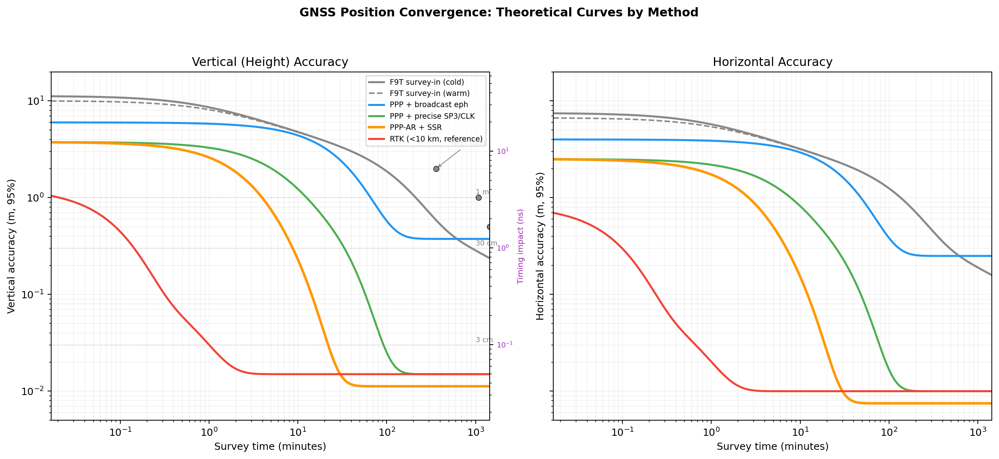
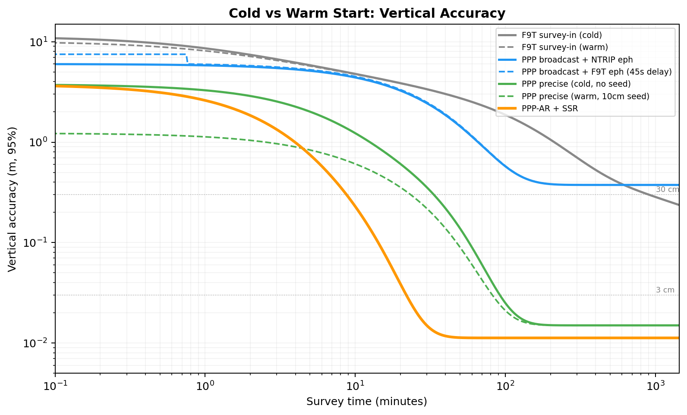

# Position Convergence: Why Each Method Has the Curve It Has

How quickly can you determine your antenna's position, and how accurately?
The answer depends on which error sources you can eliminate and how fast you
can do it. This document walks through the physics behind the convergence
curves for five positioning methods, from the F9T's built-in survey to
PPP-AR with SSR corrections.

## The error budget that shapes every curve

A raw pseudorange measurement from a dual-frequency receiver carries
roughly 2-5 m of error. That error comes from a stack of sources, and
each positioning method peels off a different layer:

| Error source | Magnitude | Eliminated by |
|---|---|---|
| Ionosphere (1st order) | 2-50 m | Dual-frequency IF combination |
| Broadcast orbit error | 1-2 m | Precise SP3 orbits |
| Broadcast clock error | 0.5-2 m | Precise CLK files or SSR |
| Troposphere | 2-10 m zenith | Model + estimation in filter |
| Multipath | 0.5-5 m | Sidereal averaging, antenna design |
| Receiver noise | 0.3-1 m | Carrier phase (mm-level noise) |
| Carrier phase ambiguity | N/A (must be estimated) | Integer resolution via SSR phase bias |

The curves in the plots are shaped by which layers remain and how the
filter (or averager) beats them down over time.

## F9T standalone survey-in

The F9T's built-in survey mode computes single-point position fixes
(SPP) every second and averages them. This is not a Kalman filter
convergence -- it is arithmetic averaging of noisy SPP solutions.

The curve starts at 10-18 m (first fix) and improves roughly as
1/sqrt(N) for the first hour. But the real gain comes from **satellite
geometry rotation**. As the constellation shifts over hours, systematic
biases from multipath and troposphere project differently into the
position solution. Averaging across 3-4 hours of changing geometry
beats down biases that a fixed geometry cannot.

Montare et al. (2024) measured 14 independent cold-start 24-hour surveys
with the F9T and found the height estimate reliably reaches within 2 m
of the PPP truth after 6 hours, within 1 m after 18 hours, with final
dispersion of about 0.5 m. Their results are biased high relative to PPP,
and they note that each meter of vertical error corresponds to up to
3.3 ns of timing error -- motivating the search for faster, more accurate
methods.

**Warm vs cold start**: A warm F9T (has almanac and approximate position
from a previous session) reaches first fix in 5-10 seconds instead of
25. That saves a few tens of seconds but does not change the convergence
curve shape -- the same multipath and orbit errors dominate from the
first minute onward. The dashed gray line on the plot is nearly
indistinguishable from the solid one.

**Asymptotic floor**: SPP averaging cannot get below roughly 30 cm
vertical because multipath repeats on a sidereal day. The same
reflections, the same satellites, the same errors -- a 24-hour average
sees them all twice and cannot separate signal from systematic bias.

## PPP with broadcast ephemeris

PPP (Precise Point Positioning) replaces SPP averaging with an Extended
Kalman Filter that jointly estimates position, receiver clock, inter-system
biases, tropospheric delay, and carrier-phase ambiguities. The carrier
phase measurements have millimeter-level noise, which is what ultimately
pulls the solution tight.

With broadcast ephemeris, the satellite orbits are only known to 1-2 m
and the clocks to 0.5-2 m. The filter converges to a floor set by these
orbit/clock errors -- roughly 50 cm vertical. The curve drops faster
than survey-in (the EKF is smarter than averaging) but hits a wall that
no amount of time can break through.

**NTRIP ephemeris vs F9T SFRBX**: When using NTRIP for broadcast
ephemeris, the filter can start processing immediately. When relying on
the F9T's own satellite signals, it must wait 30-60 seconds to decode
a full GPS ephemeris (subframes 1-3 at 6 seconds each, but you may not
catch subframe 1 on the first try). This shifts the curve right by
30-60 seconds -- visible on the cold/warm plot but insignificant compared
to the 30+ minute convergence time. NTRIP ephemeris helps the most for
cold starts where the receiver has no cached almanac.

## PPP with precise products

Replace broadcast orbits/clocks with IGS precise products (SP3 orbits
at 2 cm accuracy, CLK files at 0.1 ns / 3 cm accuracy) and the floor
drops to centimeter level. The convergence curve now has two phases:

1. **Fast phase (0-5 min)**: Pseudoranges pull the position from meters
   to sub-meter. The filter is primarily estimating position and clock.

2. **Slow phase (5-40 min)**: Carrier-phase ambiguities converge as
   float values. The filter must separate position from ambiguity from
   troposphere -- these are correlated, and decorrelation requires
   satellite geometry to change. This is why PPP takes 30-60 minutes
   even with perfect orbits.

Clock sampling rate matters: 30-second CLK files converge measurably
faster than 5-minute CLK files because the filter can track rapid clock
variations rather than interpolating.

**Warm start with a 10 cm seed**: If you already know your position to
10 cm (from a previous PPP session), the filter skips the fast phase
entirely. The position states are essentially converged at startup, and
only the ambiguities and troposphere need to settle. This saves 10-20
minutes -- the dashed green line on the cold/warm plot. NovAtel's
PPPSEED documentation reports 2-minute reconvergence when restoring a
previously converged position.

**Warm start with a 10 m seed**: Modest help. The filter starts closer
but still needs the fast phase. Saves perhaps 5 minutes.

## PPP-AR with SSR corrections

SSR (State Space Representation) corrections deliver precise orbit,
clock, and critically **phase bias** corrections in real time via NTRIP.
The phase biases enable integer ambiguity resolution (AR) -- instead of
estimating ambiguities as float values, the filter can fix them to
integers once the position is close enough.

This changes the convergence curve fundamentally. Without AR, the slow
phase takes 20-40 minutes because float ambiguities and position are
correlated and must decorrelate through geometry change. With AR, once
the float ambiguities are close to integer values (typically 5-10
minutes), the filter snaps them to integers and the position jumps to
centimeter accuracy. The knee in the orange curve is this snap.

The asymptotic accuracy is 1.5-2 cm rather than the 2-3 cm of float PPP,
and it gets there 3-10x faster. Triple-frequency receivers (L1+L2+L5)
can further reduce AR time because the extra frequency provides
additional geometry for ambiguity separation.

## Local NTRIP RTK (reference curve)

RTK (Real-Time Kinematic) takes a fundamentally different approach:
instead of modeling satellite errors globally (as PPP does), it
differences observations between a nearby base station and your rover.
At short baselines (<10 km), the atmosphere, orbits, and clocks are
nearly identical at both stations and cancel in the difference.

The result is near-instantaneous centimeter accuracy once integer
ambiguities are resolved (10-60 seconds). The red curve on the plot
drops from SPP to 2 cm in under a minute. This is the gold standard
for speed, but it requires a base station within range.

**Accuracy vs distance**: RTK accuracy degrades at roughly 1 mm/km
(1 ppm) because differential atmospheric errors grow with baseline.
At 10 km: ~2.5 cm vertical. At 20 km: ~3.5 cm vertical. Beyond 20 km,
integer ambiguity resolution becomes unreliable.

**Using RTK just for seeding**: Even a brief RTK fix (a few minutes)
gives a centimeter-level position that can seed a PPP filter. This is
an excellent strategy for sites near an NTRIP caster -- use RTK for the
initial fix, then switch to PPP-AR for long-term stability independent
of the base station. The risk is that a faulty base station gives a
wrong seed; the PPP filter should detect this as growing residuals
within minutes.

**The F9T cannot do RTK positioning.** It accepts RTCM corrections only
for differential timing (via the proprietary RTCM 4072.1 message with
another F9T as reference). For RTK positioning you would need an F9P or
similar receiver. The RTK curve is shown for reference to illustrate
what the technique can achieve.

## What does not matter much

**Receiver warm/cold start**: Saves 10-30 seconds of TTFF. Irrelevant
compared to filter convergence times of minutes to hours.

**NTRIP vs SFRBX ephemeris**: Saves 30-60 seconds. Visible on the plot
but not significant for any method except the fastest (RTK).

**Number of measurements per epoch**: More satellites help geometry but
with diminishing returns beyond ~12. Going from 8 to 20 SVs does not
halve convergence time.

## What matters enormously

**Orbit/clock product quality**: The single biggest factor. Broadcast
(1-2 m) vs precise (2-3 cm) moves the asymptotic floor by 20x.

**Carrier phase + ambiguity resolution**: The difference between 50 cm
and 2 cm, and between 60 minutes and 10 minutes.

**Position seed quality**: A 10 cm seed vs no seed saves 10-20 minutes
of PPP convergence. Worth doing if you have a previous position.

**Multi-constellation**: Adding Galileo to GPS roughly halves convergence
time by doubling available geometry. Adding BDS helps further but with
diminishing returns and additional complexity (time system offsets,
inter-system biases).

## References

- Montare, A.A., Novick, A.N., Sherman, J.A. (2024). "Evaluating
  Common-View Time Transfer Using a Low-Cost Dual-Frequency GNSS
  Receiver." NIST Technical Publication 3280.
  https://tf.nist.gov/general/pdf/3280.pdf

- Choy, S., Bisnath, S., Rizos, C. (2017). "Uncovering common
  misconceptions in GNSS Precise Point Positioning and its future
  prospect." GPS Solutions, 21(1), 13-22.

- Elsheikh, M. et al. (2023). "The Implementation of Precise Point
  Positioning (PPP): A Comprehensive Review." Sensors, 23(21).

- Lombardi, M.A. (2016). "Evaluating the Frequency and Time Uncertainty
  of GPS Disciplined Oscillators and Clocks." NCSLI Measure, 11(3-4).

- u-blox ZED-F9T Integration Manual, UBX-20033630.
